### The first part of the test is a web page listing all the available brokers from the BrazilAPI
### JSON flow to copy and paste: [Flow JSON](flow.json)

In the end of this document, there is the JSON Flow of all the project to copy and paste on node-red import option.

The first thing to do, is to open a node-red locally running server on the terminal by tipying "node-red", like the example bellow:

Then, you need to copy the URL of the local server in the terminal and paste it on the browser: 

When the node-red server load in your browser, you will need four nodes connected:

http in ---> http request ---> function ---> http response

 like the example bellow:

Now, you need to do the node configuration:

Node 1: http in

Node 2: http request

Node 3: function

Set the function to "On message" and paste the code below:

[Function code](Files/code.txt)

Node 4: http response

Click on deploy then access http://127.0.0.1:1880/brokers to see the web page listing all the brokers from BrazilAPI

### The second part of the test is a web page capable to show details of a provided zip code using BrazilAPI

# Option 1: Route Input (/cep/:cep)

Node 1: http in

Node 2: change

Node 3: Link out

# Option 2: HTML Form(/search-cep)

Node 1: http in

Node 2: Template

[Template code](Files/templatecode.txt)

Node 3: http response

# Option 2: Form Processing (/submit-cep)

Node 1: http in

Node 2: Change

# API logic 

Node 1: link in

Node 2: Function

Node 3: http request

Node 4: template 

Node 5: Link Out

Node 6: Error template

Node 7: change node

Node 8: link in 

Node 9: http response

access http://127.0.0.1:1880/search-cep to search a zip code

The final look of the project is going to be something like this:
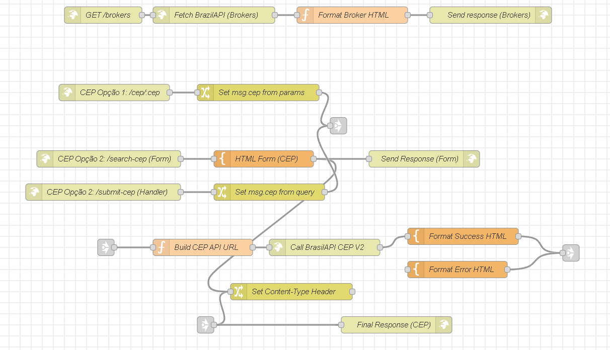

JSON flow to copy and paste: [Flow JSON](flow.json)

### MQTT Challenge:
I have chosen the MQTT topic to do a microservice. The service removes the need for a web-facing interface (HTTP) and instead operates entirely over the MQTT protocol. It follows an asynchronous request/response pattern.

Workflow:

Listen: The service subscribes to the MQTT topic cep/request and waits for a message (a CEP as a string) to be published.

Process: Upon receiving a CEP, the flow calls the external BrasilAPI (via an HTTP Request) to fetch the full address details.

Respond: The service formats the API's response as a JSON object and publishes it to a success topic: cep/details.

The microservice is robust and includes a dedicated path for failures. If the BrasilAPI returns an error (such as an invalid or unfound CEP), the flow catches this, formats a JSON error message, and publishes it to a separate topic: cep/error.

Node 1: mqtt in (Listen for CEP)

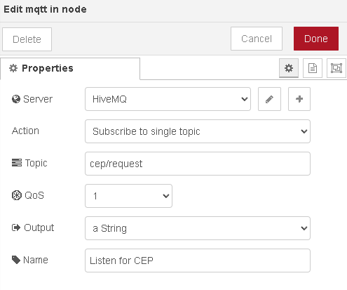

Node 2: change (Set msg.cep from payload)

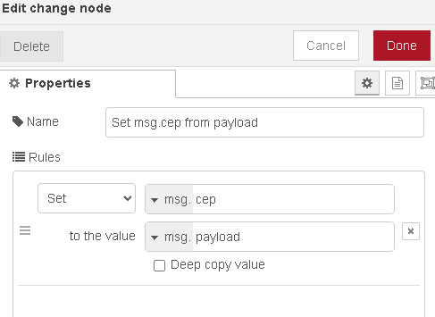

Node 3: function (Build CEP API URL)

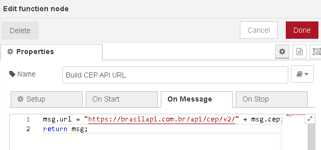

Node 4: http request (Call BrasilAPI CEP V2)

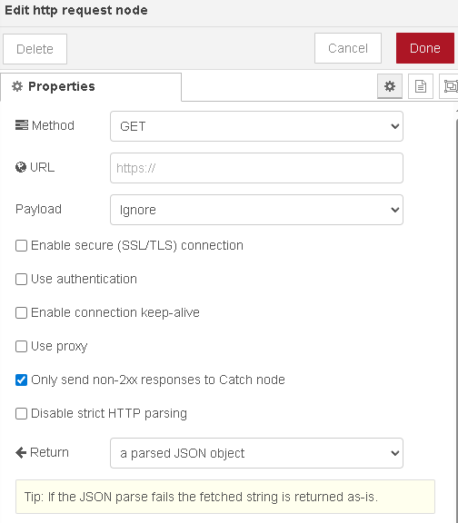

Node 5: json (Convert Object -> String)

Node 6: mqtt out (Publish Details)

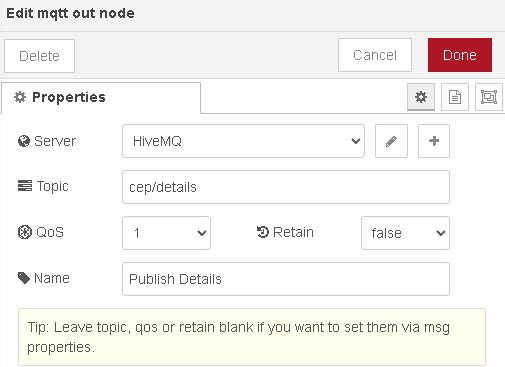

Node 7: function (Format Error JSON)

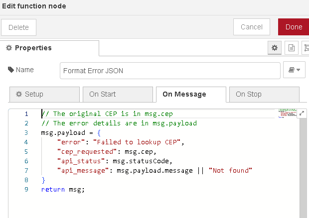

Node 8: json (Convert Object -> String)

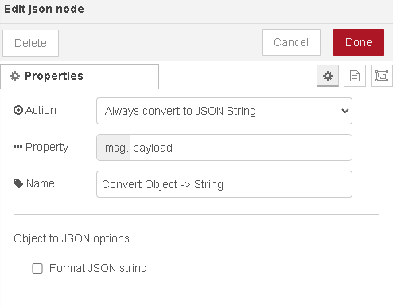

Node 9: MQTT Out (publish error)

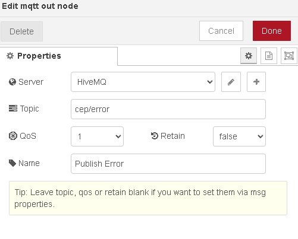

Example of the microservice use:

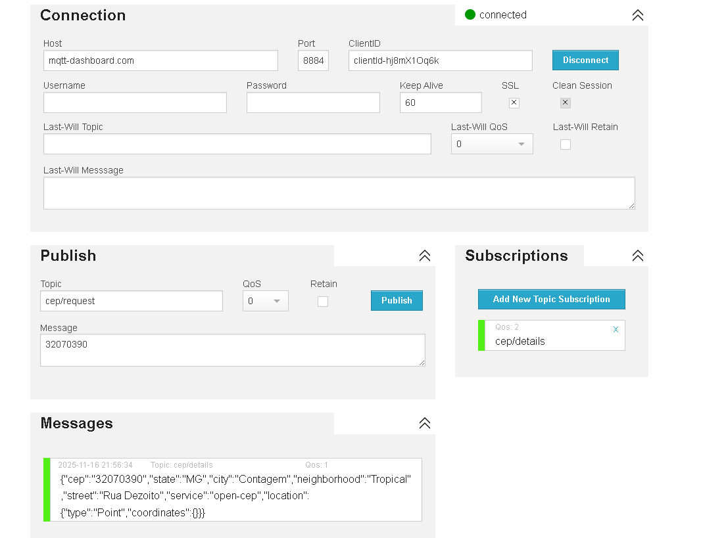

How to Test the MQTT Microservice
You cannot use your browser. You must use an MQTT client, like the HiveMQ Web Client:

Go to: http://www.hivemq.com/demos/websocket-client/

Click Connect.

In the Subscriptions section, click Add New Topic Subscription and subscribe to the topic: cep/details

In the Publish section, set the Topic to: cep/request and in the Message, type a CEP: 01001000

Click Publish.

The result (the address JSON) will instantly appear in the Messages box.

### Final look of the project + MQTT Challenge:

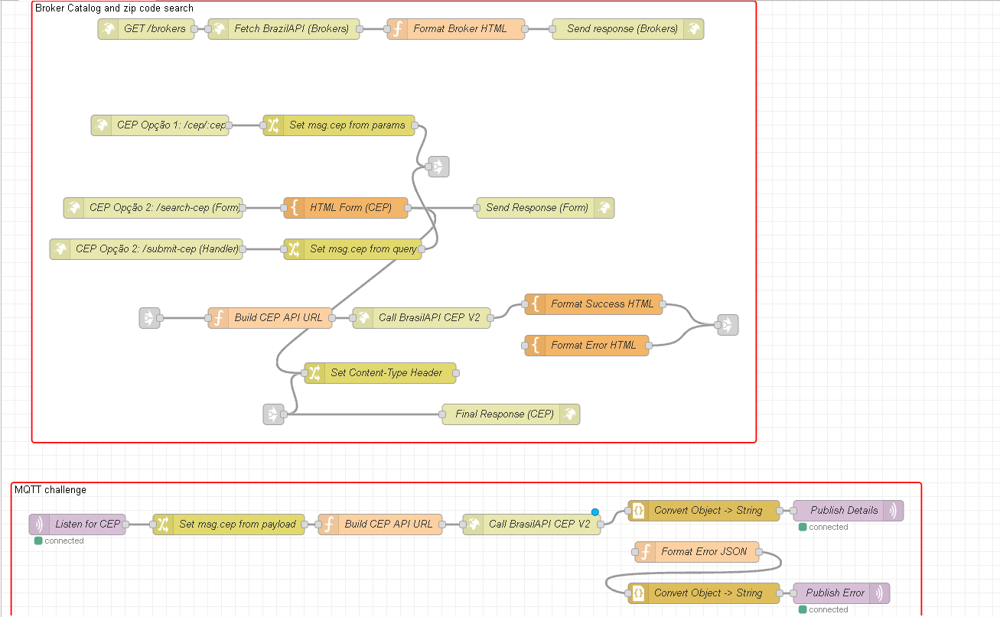

