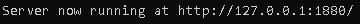
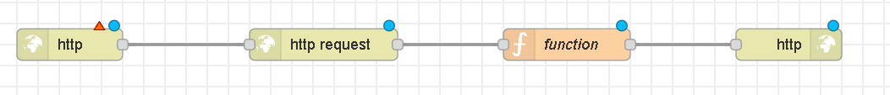

### The first test is a web page listing all the available brokers from the BrazilAPI

The first thing to do, is to open a node-red locally running server on the terminal by tipying "node-red", like the example bellow:

Then, you need to copy the URL of the local server in the terminal and paste it on the browser: 

When the node-red server load in your browser, you will need four nodes connected:

http in ---> http request ---> function ---> http response

 like the example bellow:

Now, you need to do the node configuration:

Node 1: http in

Node 2: http request

Node 3: function

Set the function to "On message" and paste the code below:

[Function code](Files/code.txt)

Node 4: http response

Click on deploy then access http://127.0.0.1:1880/brokers to see the web page listing all the brokers from BrazilAPI