### The first part of the test is a web page listing all the available brokers from the BrazilAPI
In the end of this document, there is the JSON Flow of all the project to copy and paste on node-red import option.

The first thing to do, is to open a node-red locally running server on the terminal by tipying "node-red", like the example bellow:

Then, you need to copy the URL of the local server in the terminal and paste it on the browser: 

When the node-red server load in your browser, you will need four nodes connected:

http in ---> http request ---> function ---> http response

 like the example bellow:

Now, you need to do the node configuration:

Node 1: http in

Node 2: http request

Node 3: function

Set the function to "On message" and paste the code below:

[Function code](Files/code.txt)

Node 4: http response

Click on deploy then access http://127.0.0.1:1880/brokers to see the web page listing all the brokers from BrazilAPI

### The second part of the test is a web page capable to show details of a provided zip code using BrazilAPI

# Option 1: Route Input (/cep/:cep)

Node 1: http in
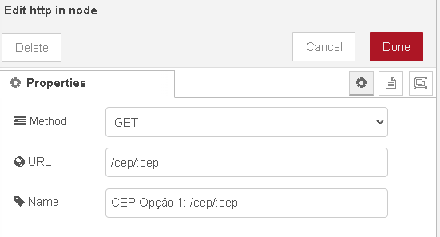

Node 2: change
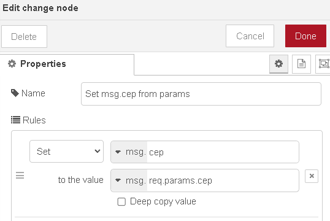

Node 3: Link out
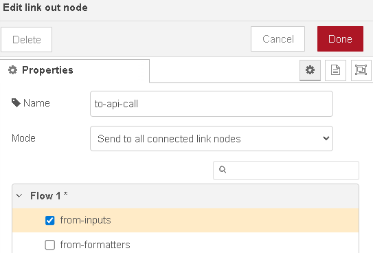

# Option 2: HTML Form(/search-cep)

Node 1: http in
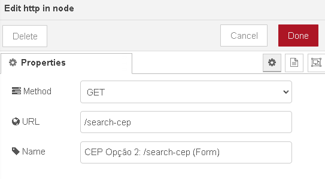

Node 2: Template
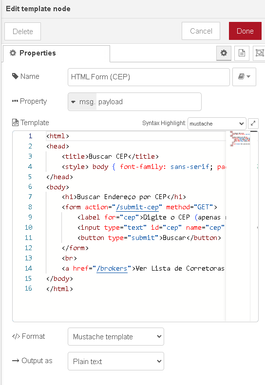

[Template code](Files/templatecode.txt)

Node 3: http response
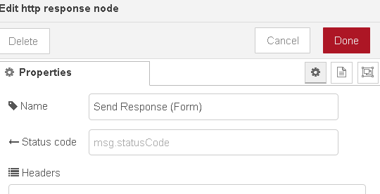

# Option 2: Form Processing (/submit-cep)

Node 1: http in

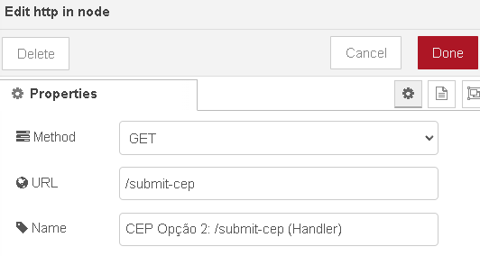

Node 2: Change

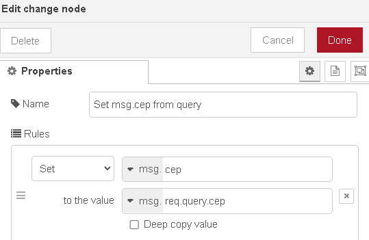

# API logic 

Node 1: link in

Node 2: Function

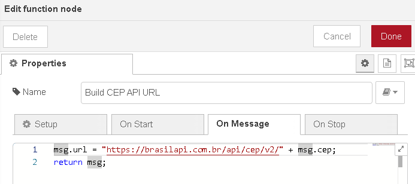

Node 3: http request

Node 4: template 

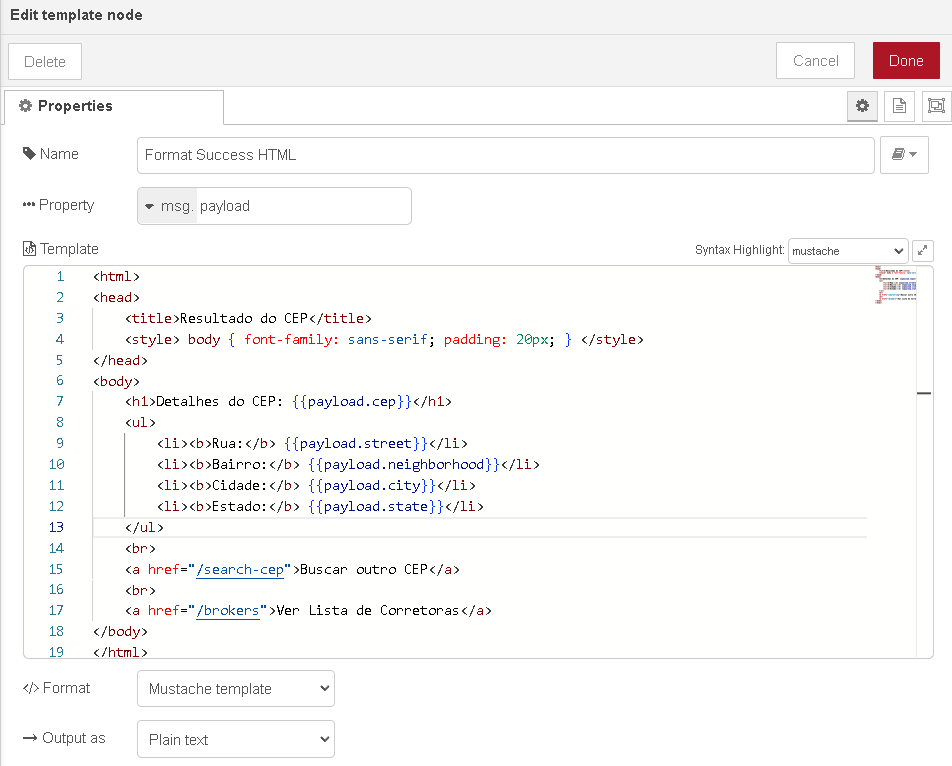

Node 5: Link Out

Node 6: Error template

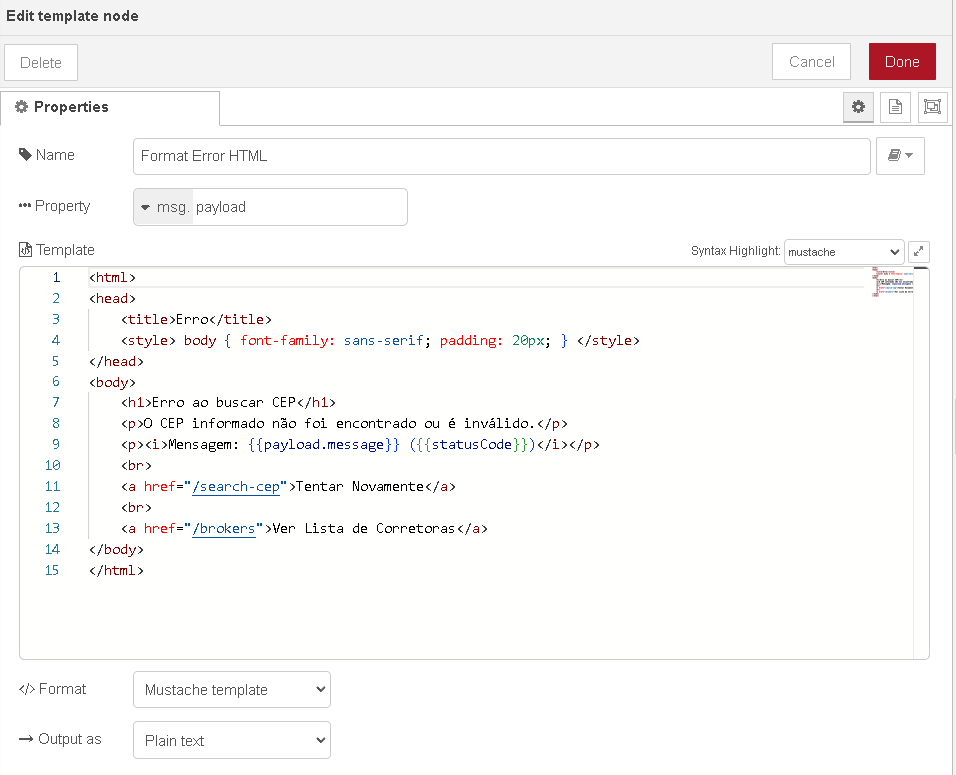

Node 7: change node

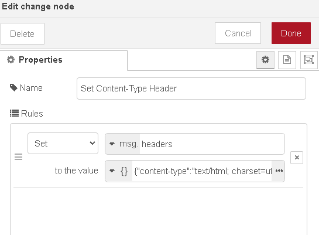

Node 8: link in 

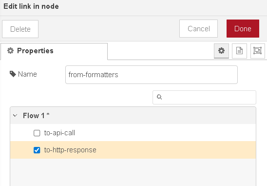

Node 9: http response

JSON flow to copy and paste: [text](flow.json)